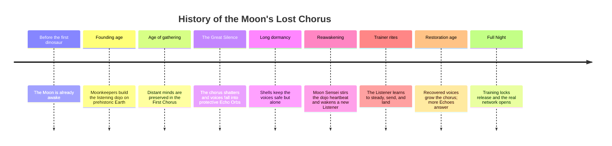
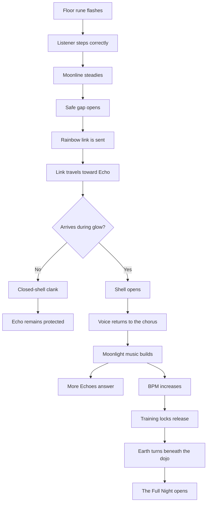

# Deepening the Lore of the Moonline Action System

## Executive summary

The uploaded design brief already contains a strong, unusually coherent action grammar: **step on the flash, send in the gap, land on the glow**. In canon, those actions are not generic inputs but a fixed chain with fixed outcomes: stepping steadies the Moonline, sending in the gap launches the rainbow link at the safe time, and landing during the glow opens the Echo Orb so its voice returns to the chorus. The same brief also defines the consequences of failure, repetition, escalation, graduation, and orb subtypes. Because your instruction requires that every action keep its original tied outcome, the most effective lore strategy is not to invent new powers or mechanics, but to make each outcome feel ancient, necessary, and embedded in a larger civilization. fileciteturn0file0

The strongest mythic anchor for this setting is the old association between **memory, song, law, and divine speech**. In Hesiod, Mnemosyne gives birth to the Muses, whose song relieves sorrow and sings the laws and portions of the cosmos; that is an excellent fit for a game where restored voices literally rejoin a cosmic chorus. Selene provides a second anchor, because the moon is described as a radiant sign and token to mortals, tying lunar light to timing and reliable cycles. Hermes adds the third anchor: he is a messenger, patron of roads, language, and cunning transmission, and he invents the lyre by stringing a shell. Together, those sources make the current system feel less like abstract UI and more like the surviving ritual technology of a memory-civilization. citeturn5view1turn5view3turn18view1turn18view2turn17view0turn18view3turn18view4

The most useful folkloric addition is the widespread “external soul” or “heart in the egg” motif. That motif provides a persuasive narrative precedent for voices preserved inside shells, nested protections, and “deep” Echoes that require repeated, correctly timed awakenings. Anthropological ideas of liminality also fit the gap and the glow: both are threshold moments, and rites of passage classically operate through separation, transition, and incorporation. In this system, the player repeatedly performs those phases: stepping prepares, the gap transitions, and the successful landing reincorporates the lost voice into communal order. citeturn14search0turn20search1turn19search0turn19search3

Accordingly, the report below recommends a lore architecture in which the Moonkeepers were not just technicians but custodians of **listening law**: a civilization that understood rhythm as calibration, silence as a moral interval, and successful contact as a form of rescue rather than combat. It also proposes interlocking surrounding systems—political, religious, economic, magical, and ecological—because coherent worldbuilding is strongest when history, culture, and ecology reinforce one another, and because complex systems are more believable when their layers feed back into each other rather than existing in isolation. citeturn22search4turn22search5turn13academia0turn13academia8

## Canon and assumptions

This analysis treats the uploaded specification as the **sole canonical source** for current mechanics, themes, and vocabulary. That source defines the player as the Listener, the coach as Moon Sensei, the rainbow projectile as the Moonline link, the orb as a lost voice in an Echo Orb, the gap as the safe send moment, the glow as the listening blink, the closed-shell impact as a clank, success as voice return, escalating music as chorus restoration, and graduation as the opening of the Full Night. It also explicitly constrains tone, delivery, and UI burden. fileciteturn0file0

The report makes five operating assumptions where the brief is intentionally sparse. First, it assumes that “actions” should include both **player inputs** and the most important **system responses** that are already canonized by the brief. Second, it assumes that any new lore must remain compatible with the project’s delivery constraints: no new cutscenes, no lore panel, no new mode, and no requirement that experienced players pass through added exposition. Third, it assumes that mythic and cultural inspirations should be treated as **analogical influences**, not direct transplants, so the world feels old and resonant without becoming a patchwork of borrowed unaltered traditions. Fourth, it assumes the prehistoric, abstract dojo should remain visually abstract and not be replaced by a geographic overworld. Fifth, it assumes that added lore should explain why the canon works, not change what the canon does. fileciteturn0file0

For methodological guidance, this report follows a conservative worldbuilding principle: preserve the **coherence of history, culture, and ecology**, and treat the setting as an interdependent system rather than a collection of disconnected cool facts. That approach aligns both with common worldbuilding guidance on coherent imaginary worlds and with systems scholarship showing that multilayer networks become more intelligible when their interlayer connections are made explicit. citeturn22search4turn22search5turn13academia0turn13academia8

## Canonical action catalog

The table below catalogs the current action→outcome bindings already present in the uploaded brief. It is intentionally conservative: nothing here changes the mechanical result, success condition, input burden, pacing rule, or player-facing teaching function. All rows are distilled from the specification. fileciteturn0file0

| Canonical action or event | Tied outcome that must remain unchanged | Canonical narrative meaning |
|---|---|---|
| Tap the correct flashing letter / step on the flashing floor rune | **Steadies the Moonline and the field** | The Listener performs the Moonkeeper step-code |
| Use the gap after the step | **Safe moment to send a link** | The World Drum leaves an interval for transmission |
| Send the rainbow link / light-thread | **Projectile begins travel toward the Echo** | The link needs time to reach a distant voice |
| Land the link while the Echo glows | **Shell opens; voice is released and returned to the chorus** | Successful listening blink |
| Strike a closed shell | **Closed-shell clank; Echo could not hear yet** | Failure due to mistimed arrival |
| Miss completely | **Link lost** | Failed transmission |
| Hit a Deep Echo on one glow, then again on later glow(s) | **Several listening blinks are needed** | A deeply sleeping voice requires repeated awakening |
| Succeed repeatedly | **Recovered voices join Moonlight; music builds** | The chorus is literally restored |
| Chorus grows | **New Echoes appear** | More isolated voices answer the song |
| Chorus grows stronger | **Faster BPM** | The restored chorus beats more strongly |
| Training locks release | **Earth turns beneath the dojo / dolly effect** | The sheltered training state ends |
| Restless Echo behavior | **Juke / brownian movement** | Startled or wandering Echoes become harder to reach |
| Graduation | **Moon Sensei opens the Full Night** | The Listener enters the real network |

The same source also defines an orb taxonomy that is worth preserving, because it gives ready-made personality categories for lore expansion without changing gameplay: normal orb = Echo, gold orb = Ancient Echo, speed orb = Quick Echo, mover orb = Wandering Echo, and multi-hit/tank = Deep Echo. That taxonomy already suggests age, temperament, and sleep-depth distinctions that lore can amplify. fileciteturn0file0

## Mythic and cultural inspirations

The following matrix pairs each canonical action with inspirations that enrich it while preserving its outcome. The goal is not one-to-one adaptation, but thematic fit and explanatory depth.

| Canonical action | Best-fit inspiration | Why it plausibly enriches the pair | Source basis |
|---|---|---|---|
| Step on the flash → Moonline steadies | Mnemosyne and the Muses; ritual memory; embodied synchronization | The Muses are born from Memory and their song orders law, grief, and divine portions; rhythm research also supports the intuitive link between repeated pulse and coordinated action | Hesiodic and Orphic material on Mnemosyne and the Muses; synchronization studies citeturn5view1turn5view3turn18view1turn23academia0turn23academia6 |
| Send in the gap → safe transmission window | Liminality; Hermes as messenger, road-god, and patron of language | The gap is a threshold state, and Hermes provides a divine model for messages, crossings, roads, and swift mediated contact | Turner/van Gennep summaries; Hermes material citeturn19search0turn19search3turn17view0turn18view4 |
| Link travels over time → must be sent early | Bridge motifs; Bifröst; messenger-road symbolism | A delayed arrival is narratively legible if the link is a traversing path rather than an instantaneous beam | Bifröst as bridge between earth and heaven; Hermes as road and herald deity citeturn10search0turn17view0turn18view4 |
| Land on the glow → shell opens, voice returns | Selene as lunar sign and timing; Muses as sweet, law-bearing voices | Success depends on arriving in the moon-marked right moment, and the reward is not damage but recovered voice | Selene hymn and Muses passages citeturn18view2turn5view1turn5view3 |
| Closed-shell clank → voice not yet reachable | Threshold taboo; consent-and-timing reading | The shell is not “armour” in a combat sense, but a protective threshold that can only be crossed at the proper moment | Rites-of-passage threshold logic and uploaded canon citeturn19search0turn19search3turn0file0 |
| Deep Echo → multiple glows required | External soul / heart-in-the-egg folklore | Nested or layered preservation offers a strong old-world precedent for a voice protected across several openings | ATU 302 motif summaries citeturn14search0turn20search1 |
| Shell becomes starlight → release, not death | Hermes makes music from a shell | A shell transformed into instrumentality rather than destruction directly supports the brief’s non-combat tone | Hermes and the tortoise-shell lyre citeturn18view3 |
| Chorus growth → new Echoes, faster BPM, larger system response | Muses sing laws and portions; multilayer ecological systems | Restoring voices plausibly changes institutions, ecology, and network behavior because interconnected systems amplify across layers | Muses on law and portions; multilayer systems scholarship citeturn5view1turn5view3turn13academia0turn13academia8 |
| Graduation / Full Night → real network opens | Rite of incorporation | Training becomes initiation: the sheltered novice phase ends and the initiated person enters communal order | Rites-of-passage framework citeturn19search0turn19search3 |

A particularly fruitful synthesis emerges from the combination of **Mnemosyne + Selene + Hermes**. Mnemosyne explains why the rescued object is a voice rather than energy or loot; Selene explains why timing, cycles, and visible radiance matter; Hermes explains why the link behaves like a message on a road and why a shell can become a musical device. Added to that, the ATU 302 “external soul” motif gives a folklore precedent for voices protected inside nested or delayed-opening housings, which fits Deep Echoes especially well. citeturn5view1turn5view3turn18view1turn18view2turn17view0turn18view3turn18view4turn14search0turn20search1

## Expanded lore framework

What follows is a design-bible layer: lore that could inform writing, VO, environmental hints, music naming, achievement text, artifact props, and future ancillary materials, while keeping all mechanical outcomes untouched.

| Action | Expanded backstory and motivation | Long-term consequences | Artifact, ritual, NPC, location, and short in-world text |
|---|---|---|---|
| **Step on the flash** | The Moonkeepers learned that memory could not be trusted to script alone; it had to be kept in the body. Their step-code was therefore both calibration and oath. Every correct step repeats the “First Listening Walk,” the rite by which apprentices proved they could hold rhythm without forcing it. The Listener does not merely answer a prompt; they keep the field from drifting apart. | Societies descended from the Moonkeepers judge legitimacy by cadence. Bad rulers are remembered not as cruel first, but as “off-step,” meaning they broke alignment between promise and pulse. | **Artifact:** Heel-glyph sandals called *remembering soles*. **Ritual:** The Four-Step Vigil at new moon. **NPC archetype:** Step Reader, a quiet trainer who diagnoses emotional imbalance by footfall timing. **Location:** Quadrate of First Footfalls. **Text:** “Set your weight where the Moon asks, and the road will remember you.” This action remains canonically tied to steadying the Moonline. citeturn5view1turn5view3turn18view1turn23academia0turn23academia6turn0file0 |
| **Send through the gap** | The gap is remembered in Moonkeeper theology as the *Mercy Between Beats*. The old doctrine taught that voices cannot be reached by forceful overlap; a true message must enter during the world’s small act of listening. That makes the gap a moral interval, not just a timing window. | Diplomatic culture develops around “gap-law”: envoys pause one beat before speaking in council, and judges must leave a ceremonial silence before verdicts. Skilled Listeners become symbolic models of restraint. | **Artifact:** A slim wrist-threader called the *Quiet Arc*. **Ritual:** The Seven Silences, in which novices breathe without stepping. **NPC archetype:** Gap Scribe, a courier-priest who teaches patience. **Location:** Hall of Intervals. **Text:** “Do not speak over the drum; let the world make room for your light.” This action remains canonically tied to the safe moment to send. citeturn19search0turn19search3turn17view0turn18view4turn10search0turn0file0 |
| **Land on the glow** | Moonkeeper doctrine holds that every Echo Orb contains not raw data but a *listening personhood*: a preserved voice waiting for the single instant when trust outweighs fear. The glow is therefore called the *listening blink*. A correct landing is compassionate accuracy: the Listener proves they anticipated the Echo’s opening instead of battering at its shell. | Successful returns produce names, songs, legal precedents, star-routes, and prayers that re-enter collective culture. Families, cults, or guilds may claim descent from certain recovered voices, creating prestige politics around famous returns. | **Artifact:** A crescent lens called the *Blink Gauge*. **Ritual:** Lanterns are opened and closed once during memorial nights to imitate the blink. **NPC archetype:** Voice Midwife, keeper of first-heard names. **Location:** Blink Court. **Text:** “Arrive when it dares to hear, and its name will rise.” This action remains canonically tied to shell opening and voice return. citeturn18view2turn5view1turn5view3turn0file0 |
| **Closed-shell clank** | After the Great Silence, protective shells were redesigned to prefer loneliness over loss. The clank is thus ancient mercy: the shell refusing contact when the world is too early, too loud, or too wrong. In Moonkeeper ethics, a clank is not a punishment sound but a reminder that preservation precedes reunion. | Cultures built around the chorus become unusually sensitive to consent, timing, and the difference between invitation and intrusion. Religious conservatives may even praise the clank as proof that the old wards still keep faith. | **Artifact:** Black resonance bowls used to teach novices the sound of refusal. **Ritual:** One bead is moved on the Clank Cord after every premature strike. **NPC archetype:** Quiet Warden. **Location:** Cloister of Closed Petals. **Text:** “The shell did not refuse you; it protected what it keeps.” This event remains canonically tied to the closed-shell clank. citeturn19search0turn19search3turn0file0 |
| **Deep Echo requires repeated glows** | Some voices were sealed during the earliest and most violent phase of the Great Silence, when shellwrights layered protections like nested vows. These are Deep Echoes. Each correct landing removes only one grief-ring, because the deepest sleepers do not wake fully to a single proof of care. | Deep Echoes become repositories of antique authority. When awakened, they can upend later institutions: forgotten treaties, extinct songs, or old cosmologies return and challenge the present. This makes Deep Echo recoveries politically charged. | **Artifact:** Nine-notch tally strings. **Ritual:** The Nine-Blink Fast, performed by archivists before opening vaults. **NPC archetype:** Deep Listener, revered for patience. **Location:** Vault of Sleep. **Text:** “One glow lifts one veil; stay faithful to the next.” This event remains canonically tied to requiring several listening blinks. citeturn14search0turn20search1turn18view1turn0file0 |
| **Success grows the chorus** | The First Chorus was not merely a songbook but a live network of mutually sustaining voices. Restoring one voice increases the field’s audibility for others; the song literally becomes easier to hear at a distance even as the training becomes mechanically harder. This preserves the brief’s elegant inversion: narrative hope and ludic pressure rise together. | Politics, economy, religion, and ecology all respond. More voices mean more claims of authority, more sacred festivals, more valuable night-knowledge, and stronger lunar entrainment in animals, plants, and weather-lore. | **Artifact:** Resonance ledgers that register which voices returned in which order. **Ritual:** Communities add one lifted tone to a hymn for each recovered voice. **NPC archetype:** Chorus Broker or Archive Cantor. **Location:** Aerial Archive. **Text:** “Every voice returned teaches another to answer.” This event remains canonically tied to music build, new Echo appearance, and faster BPM. citeturn5view1turn5view3turn13academia0turn13academia8turn0file0 |
| **Training locks release and the Full Night opens** | The trainer is remembered as the *Sheltered Arc*: a stillness imposed by the old masters so initiates would first learn cadence before confronting the turning world. When the locks release, the novice has crossed from rehearsal into cosmic citizenship. The Earth’s turning beneath the dojo is therefore the visible sign of incorporation. | Graduation changes status. The Listener becomes answerable not only to Moon Sensei but to all surviving houses, ruins, and rival interpreters of the chorus. In broader lore, this is where diplomacy, pilgrimage, and conflict become possible without changing the basic in-game action language. | **Artifact:** A half-open ring called the *Night Key*. **Ritual:** The Opening Breath, taken when the floor first begins to move. **NPC archetype:** Full-Night Warden, equal parts examiner and ferryman. **Location:** Rim Gate. **Text:** “The fixed floor was mercy. The turning world is trust.” This event remains canonically tied to training-lock release, Earth-turn, and graduation. citeturn19search0turn19search3turn10search0turn0file0 |

The orb subtypes can also be narratively deepened without touching their functions. A **Quick Echo** is a voice that still remembers flight and uncertainty; a **Wandering Echo** has lost its home-coordinate and moves like a displaced memory; an **Ancient Echo** comes from before later Moonkeeper reformations and may carry older names for the same truths; a **Deep Echo** is layered sleep; and an ordinary **Echo** is a recoverable, responsive lost voice. These identities fit the uploaded taxonomy and keep combat language out of the system. fileciteturn0file0

## Surrounding systems

A lore system deepens fastest when the actions sit inside institutions. Politically, the Moon’s Lost Chorus benefits from at least four standing orders. The **Cadence Court** claims authority through correct timing and ritual continuity. The **Shellwright Houses** preserve old shell-craft, arguing that safety and consent are holier than speed. The **Archive Cantors** prize recovered voices as law, memory, and precedent. The **Turned-Earth Wardens** treat Full-Night operation as frontier service, because once the training locks release the restored network becomes a contested commons. This arrangement lets the same mechanic generate future disputes over legitimacy, access, and interpretation without changing a single player action. The rationale is consistent with both the brief’s memory-song emphasis and the broader principle that imaginary worlds gain credibility when history, culture, and ecology operate coherently rather than separately. fileciteturn0file0 citeturn5view1turn5view3turn22search4turn22search5

Religiously, Moon Sensei works best not as a conventional anthropomorphic deity but as a **watchful pedagogical presence**: a lunar intelligence or sacred office perceived through architecture, light, voice, and cyclical signs. That reading fits the brief’s insistence that Moon Sensei may be implied rather than modeled, and it resonates with Selene’s role as visible lunar sign and with Mnemosyne’s role in preserving what must be remembered after descent and return. A practical cult built around this would revolve around three linked rites: **Footfall**, **Silence**, and **Return**. Step. Send. Shine. becomes not only a mnemonic but a liturgical triad. fileciteturn0file0 citeturn18view2turn18view1

Economically, recovered voices should matter. Not every voice must be a person in the modern sense; some can be remembered as songs, route-keys, seed-calendars, craft formulae, star-latitudes, or legal formulae. That makes the chorus valuable without reducing it to currency. A plausible lunar economy would therefore trade in **echo-safe materials**, **memory indices**, **ritual instruments**, and **custodianship rights** over newly recovered voice-clusters. The point is not to gamify a market, but to make success in the action loop visibly consequential in the world: when the chorus grows, somebody’s archive fills, somebody’s pilgrimage route reopens, somebody’s night harvest becomes possible again. Interdependent consequences of that kind are exactly what multilayer systems theory predicts when one layer of a network perturbs the others. citeturn13academia0turn13academia8

Magically, the setting benefits from defining the Moonline as **cadence-dependent luminous transmission**. In other words, the rainbow link is neither mere laser nor vague magic bolt; it is a message-path that stabilizes only when body rhythm, lunar timing, and field geometry agree. That framework naturally explains why stepping matters, why the gap matters, why travel time matters, and why the glow matters. It also preserves the brief’s non-combat language by making precision a matter of alignment and hospitality rather than force. Hermes is especially useful here, because he unites language, roads, heraldry, and instrument-making; in this world, the link is not a weapon but a road that behaves like music. fileciteturn0file0 citeturn17view0turn18view3turn18view4

Ecologically, the restored chorus should have consequences for the prehistoric night world. The brief already frames the moon as ancient, Earth as prehuman, and the dojo as part of a larger living field. A believable consequence is that recovered voices subtly retune nocturnal behavior: fern spore release, insect swarms, tidal ponds, moon-migrating reptiles or birds, and dew-heavy growth all become more patterned as the chorus strengthens. The key is not realism in a hard-science sense, but a consistent **lunar ecology of response**. Selene’s ancient association with visible cyclical signs and modern multilayer ecological thinking together support that choice. fileciteturn0file0 citeturn18view2turn13academia0

## Historical development and causal chains

The uploaded canon already implies a powerful long history: the Moon was awake before dinosaurs, the Moonkeepers built the listening dojo, the First Chorus stored voices of distant minds, the Great Silence shattered that chorus, and the Listener now restores it through disciplined action. The timeline below preserves that history while clarifying its causal sequence. fileciteturn0file0

The next diagram shows the core causal chain. It makes explicit why the current mechanic is already narratively elegant: each action is both a tutorial instruction and a ritual stage, and the larger world consequences emerge from repeating that same chain, not from adding new verbs. The logic of threshold crossing in rites of passage is especially helpful here: preparation, transition, incorporation. fileciteturn0file0 citeturn19search0turn19search3

A second historical layer can be added behind the Great Silence without changing gameplay. The Moonkeepers’ late era may have been defined by a strategic disagreement: whether to keep the chorus highly open and connected, or to protect every voice with stricter shells and narrower listening windows. The Silence then vindicated the Shellwrights in one sense—preservation succeeded—but also created the loneliness the Listener now heals. That tension gives the setting durable thematic depth: **safety versus openness, preservation versus contact, silence versus chorus**. It also explains why the mechanic is about timing and care rather than brute force. citeturn14search0turn20search1turn0file0

## Concise lore entries

The entries below are written as if for an internal codex, style guide, narration bible, or short promotional text set. Each preserves the original action→outcome mapping exactly.

| Action | Concise lore entry |
|---|---|
| **Steady the Moonline** | The flashing rune is not a prompt but a remembered footfall. When the Listener steps correctly, the old Moonkeeper path aligns and the Moonline steadies. Outcome unchanged: the correct letter tap stabilizes the field. fileciteturn0file0 |
| **Send through the gap** | The World Drum never yields silence for long. In the breath between beats, the Listener sends the rainbow thread along the ancient road of hearing. Outcome unchanged: the gap is the safe moment to send. fileciteturn0file0 |
| **Land on the glow** | Every Echo Orb opens only during its listening blink. If the link arrives in that brief moonlit trust, the shell unfolds and the voice comes home. Outcome unchanged: arrival on the glow releases the voice. fileciteturn0file0 |
| **Shell closed** | A clank is the sound of protection, not defeat. The shell was closed, and the Echo could not hear yet. Outcome unchanged: closed-shell collision means the arrival was mistimed. fileciteturn0file0 |
| **Link lost** | A lost link fades into the dark between signals, leaving the Echo untouched. Outcome unchanged: a miss is simply a lost transmission. fileciteturn0file0 |
| **Deep Echo** | Some voices slept through the longest dark and wake in layers. One true landing opens only one veil; the Listener must return on the next glow. Outcome unchanged: Deep Echoes require several correctly timed hits. fileciteturn0file0 |
| **Chorus growth** | No voice returns alone. Every voice restored strengthens the field, quickens the pulse, and teaches other Echoes to answer. Outcome unchanged: success builds music, spawns new Echoes, and raises tempo. fileciteturn0file0 |
| **Full Night** | The turning world is the sign that training mercy has ended. When Moon Sensei opens the Full Night, the Listener enters the living network. Outcome unchanged: graduation releases the locks and opens full play. fileciteturn0file0 |

If you want a single governing thesis for all future lore decisions, it is this: **the story is about restoring relationship through timed listening**. That thesis is firmly supported by the brief’s current design language, by old mythic links among memory, song, moonlight, and message-bearing, and by the setting’s explicit preference for wonder and rescue over combat. As long as every addition reinforces that thesis, the lore can deepen dramatically without changing the original action→outcome structure at all. fileciteturn0file0 citeturn5view1turn5view3turn18view2turn17view0turn18view4